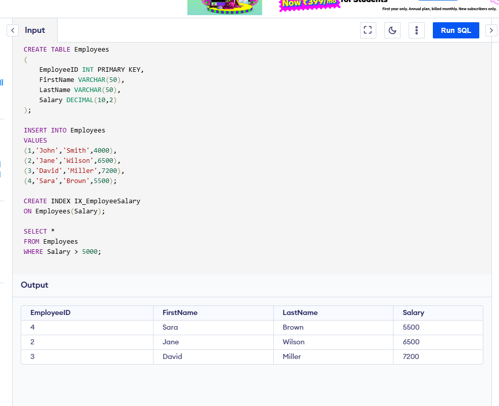

# Output

| EmployeeID | FirstName | LastName | Salary |
| ---------- | --------- | -------- | ------ |
| 2          | Jane      | Wilson   | 6500   |
| 3          | David     | Miller   | 7200   |
| 4          | Sara      | Brown    | 5500   |

## Observation

The query successfully returned employees whose salary is greater than 5000.

The index on the Salary column helps SQL Server retrieve data more efficiently.
